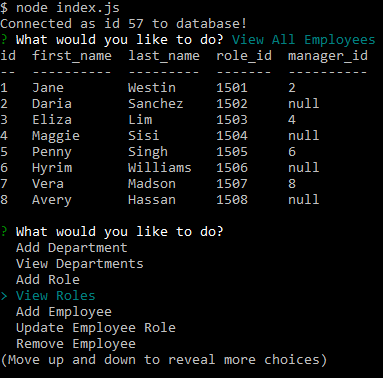

# Homework 12 - Employee Tracker

The aim of this project is to create an interface that allows users to view and interact with information stored in a MySQL database. This is done by utilizing node, inquirer, and MySQL.

## User Story

```
As a business owner
I want to be able to view and manage the departments, roles, and employees in my company
So that I can organize and plan my business

```

## Composition of Application

When the user executes the node command node index.js, the connection to MySQL is initiated. The user is then prompted to select from a variety of options to interact with the database, including -

  * View departments, roles, employees

  * Add departments, roles, employees

  * Update employee roles

  * Delete employees

After the chosen action executes (updating the database as needed), the user is prompted to select further actions or to end the connection. 

## Process

I first worked on the index.js file to set up the connection, as well as created a seed employees sql database (with department, role, and employee tables) and schema for the user to utilize. 

Inquirer prompts were used extensively to solicit user input data, and queries were also used frequently to display and utilize the most current database data. 

map() and find() methods were particularly useful for finding/matching descriptive data to id (keys) needed to update or create entries in the MySQL database.  

console.log was useful for catching errors, displaying detailed messages upon successful excution of commands, and ensuring data produced was accurate and in the right format. console.table was useful for displaying table data in a more aesthetically pleasing format. 

The dependencies for the application are listed in the package.JSON file and a gitignore file is used to to skip and prevent upload of the node_modules folder to GitHub. 

The password for the mySQL connection is stored on a separate pw.js file and included in the gitignore file to prevent upload to GitHub. 

## Deployment

The completed application is available for download in Github: 
https://github.com/jenjch/employeeTracker

Image of the application:



## Acceptance Criteria

I believe I have met all requirements for the application. With more time, I hope to clean up my code to avoid redundancies, include more validation code, and add additional functionality. Feedback on improvements is appreciated.

## License

MIT license Copyright (c) 2020 Jenny Chen 
https://choosealicense.com/licenses/mit/ 